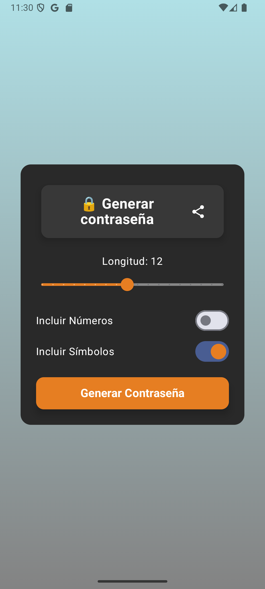
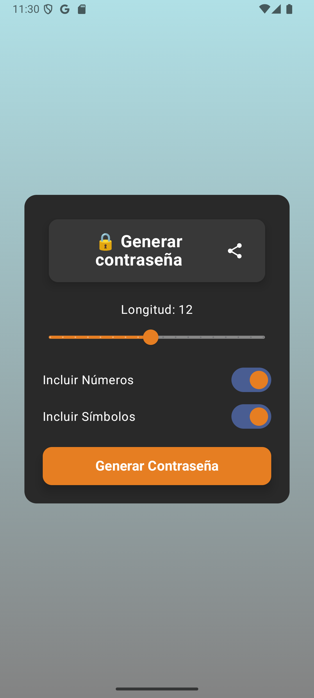
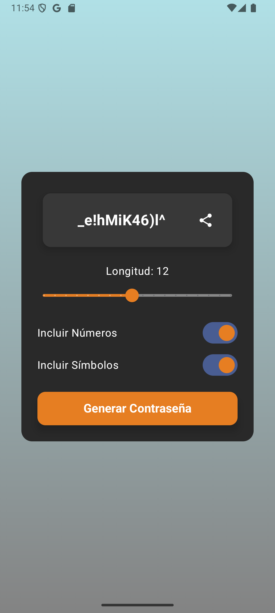

# PasswordGenerator

**PasswordGenerator** es una aplicación diseñada para generar contraseñas seguras y personalizadas de manera rápida y eficiente. Permite a los usuarios crear claves aleatorias con diferentes configuraciones para mejorar la seguridad de sus accesos en plataformas digitales.

        

---

## Características

- Generación de contraseñas aleatorias con longitud configurable.
- Opción para incluir números, caracteres especiales.
- Opción para limitar el numero de caracteres.
- Opción para copiar la password y mantenerla en el portapapeles.

---

## Tecnologías

- **Kotlin**: Lenguaje base para el desarrollo
- **Jetpack Compose**: Librería de UI  para la interfaz de usuario.
- **MVVM**: Patrón de arquitectura.

---

## Instalación

Para probar la aplicación en el dispositivo o emulador:

1. Clona el repositorio en tu máquina:
   ```bash
   git clone https://github.com/ip25-solutions/PasswordGenerator.git
